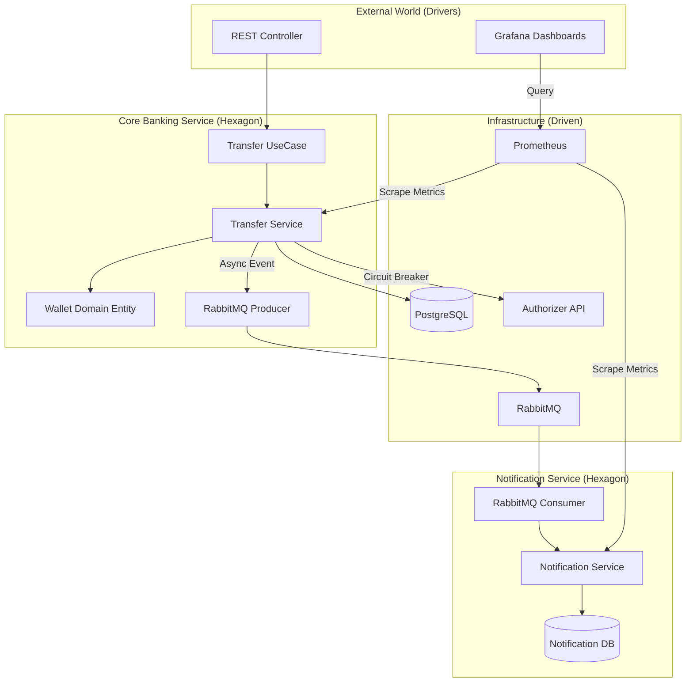

# 🛡️ Resilient Payment Gateway

> **Status:** 🚧 Em Desenvolvimento (Fase 4 Completa)
> **Arquitetura:** Hexagonal (Ports & Adapters) & Microsserviços
> **Foco:** Alta Concorrência, Resiliência, Consistência de Dados, Processamento Assíncrono e Observabilidade.

---

## 🎯 Sobre o Projeto
Este projeto é uma prova de conceito (PoC) de um **Gateway de Pagamentos** robusto, projetado para processar transferências financeiras simulando desafios reais de grandes instituições bancárias.

O objetivo principal não é apenas realizar o CRUD de transferências, mas garantir:
1.  **Integridade Transacional:** Evitar gastos duplos (Double Spending) em cenários de alta concorrência.
2.  **Resiliência:** Proteger o Core Banking de falhas em serviços externos (Fail Fast).
3.  **Desacoplamento:** Arquitetura limpa para facilitar testes e manutenção.
4.  **Assincronismo:** Processamento de notificações desacoplado via mensageria.
5.  **Visibilidade:** Monitoramento em tempo real da saúde da aplicação e métricas de negócio.

---

## 🛠️ Tech Stack

* **Linguagem:** Java 21 (Records, Pattern Matching).
* **Framework:** Spring Boot 3.
* **Banco de Dados:** PostgreSQL 15.
* **Mensageria:** RabbitMQ (Producer & Consumer).
* **Resiliência:** Resilience4j (Circuit Breaker).
* **Comunicação:** Spring Cloud OpenFeign.
* **Observabilidade:** Prometheus & Grafana.
* **Testes:** JUnit 5, Mockito, Testcontainers (Postgres), WireMock.
* **Infraestrutura:** Docker & Docker Compose.

---

## 🏗️ Arquitetura e Design Patterns

O projeto segue estritamente a **Arquitetura Hexagonal (Ports & Adapters)**. O sistema foi dividido em dois microsserviços principais:

1.  **Core Banking Service:** Responsável pelo domínio financeiro (Carteiras, Transferências, Validações).
2.  **Notification Service:** Responsável pelo envio de notificações transacionais de forma assíncrona.



## 💡 Decisões Técnicas Chave (Deep Dive)

### 1. Controle de Concorrência (Optimistic Locking)
Para evitar o problema de **Lost Update** (duas transações debitando a mesma carteira simultaneamente), utilizei a estratégia de **Optimistic Locking** com JPA (`@Version`).

* **Como funciona:** Cada atualização verifica se a versão do registro no banco é a mesma que foi lida. Se houver divergência (outra thread alterou o dado), uma `ObjectOptimisticLockingFailureException` é lançada e tratada.
* **Validação:** Comprovado via Testes de Integração utilizando `CompletableFuture` e `CountDownLatch` para simular threads concorrentes.

### 2. Resiliência com Circuit Breaker (Fail Fast)
Antes de efetivar uma transferência, o sistema consulta um **Autorizador Externo**.

* **Problema:** Se o serviço externo cair, threads podem travar aguardando timeout, causando *Cascading Failure* no banco de dados.
* **Solução:** Implementação do **Resilience4j**. Se a taxa de erros ultrapassar 50%, o circuito abre e o sistema falha imediatamente (Fail Fast), protegendo o Core.

### 3. Processamento Assíncrono e Idempotência
Após a confirmação da transferência, um evento é publicado no **RabbitMQ**. O **Notification Service** consome este evento para notificar as partes envolvidas.

* **Idempotência:** O consumidor verifica se a notificação já foi processada para o ID da transação (Chave de Idempotência), garantindo que mensagens duplicadas não gerem envios duplicados.
* **Desacoplamento:** Falhas no envio de notificação não revertem a transferência financeira.

### 4. Observabilidade Centralizada
Para garantir a operação em produção, foi adicionada uma camada de monitoramento.

* **Prometheus:** Coleta métricas expostas pelo Spring Boot Actuator (Micrometer) via endpoint `/actuator/prometheus`.
* **Grafana:** Consome os dados do Prometheus para exibir dashboards de performance (JVM, CPU, Latência HTTP) e métricas de negócio (Transações por segundo).

### 5. Tratamento de Erros (RFC 7807)
A API implementa o padrão **Problem Details for HTTP APIs (RFC 7807)** nativo do Spring Boot 3.

* **Erros de Negócio** -> `422 Unprocessable Entity` (com código interno de erro para o frontend).
* **Erros de Validação** -> `400 Bad Request` (com lista detalhada de campos inválidos).
* **Erros Inesperados** -> `500 Internal Server Error` (Log seguro no server, mensagem genérica para o cliente).

---

## 🧪 Estratégia de Testes

A qualidade é garantida através da Pirâmide de Testes, cobrindo **>83%** do código no Core Banking:

| Tipo | Ferramentas | O que testamos? |
| :--- | :--- | :--- |
| **Unitários** | JUnit 5, Mockito | Lógica de Domínio (`Wallet`), Casos de Uso e Services. |
| **Slice (Web)** | `@WebMvcTest` | Contrato da API, Serialização JSON e Tratamento de Exceções Global. |
| **Integração (DB)** | Testcontainers | Cenários de concorrência real no PostgreSQL (Double Spending). |
| **Integração (HTTP)** | WireMock | Simulação de falhas e timeouts do serviço externo para validar o Circuit Breaker. |
| **BDD** | AssertJ | Testes descritivos e legíveis focados em comportamento. |

---

## 🚀 Como Rodar Localmente

### Pré-requisitos
* Java 21
* Docker & Docker Compose
* Maven

### Passo a Passo

1.  **Subir a Infraestrutura (Banco, RabbitMQ, Prometheus, Grafana):**
    ```bash
    docker-compose up -d
    ```

2.  **Executar o Core Banking Service:**
    ```bash
    cd core-banking-service
    ./mvnw spring-boot:run
    ```

3.  **Executar o Notification Service:**
    ```bash
    cd notification-service
    ./mvnw spring-boot:run
    ```

4.  **Acessar Dashboards:**
    *   **Grafana:** http://localhost:3000 (Login padrão: `admin` / `admin`)
    *   **Prometheus:** http://localhost:9090

---

## 🚧 Próximos Passos (Roadmap)

- [x] Implementar Core Banking (Débito/Crédito).
- [x] Implementar Optimistic Locking (Concorrência).
- [x] Integração com Autorizador Externo (Feign + Resilience4j).
- [x] Publicação de Eventos no RabbitMQ (Producer).
- [x] Implementar Worker de Notificação (Consumer Assíncrono).
- [x] Implementar Idempotência (Chave única por transação).
- [x] Aumentar cobertura de testes para >80%.
- [x] Adicionar Observabilidade (Prometheus + Grafana).
- [ ] Implementar em uma infraestrutura na núvem.

---

Developed by **Ryan Silva** 👨‍💻
