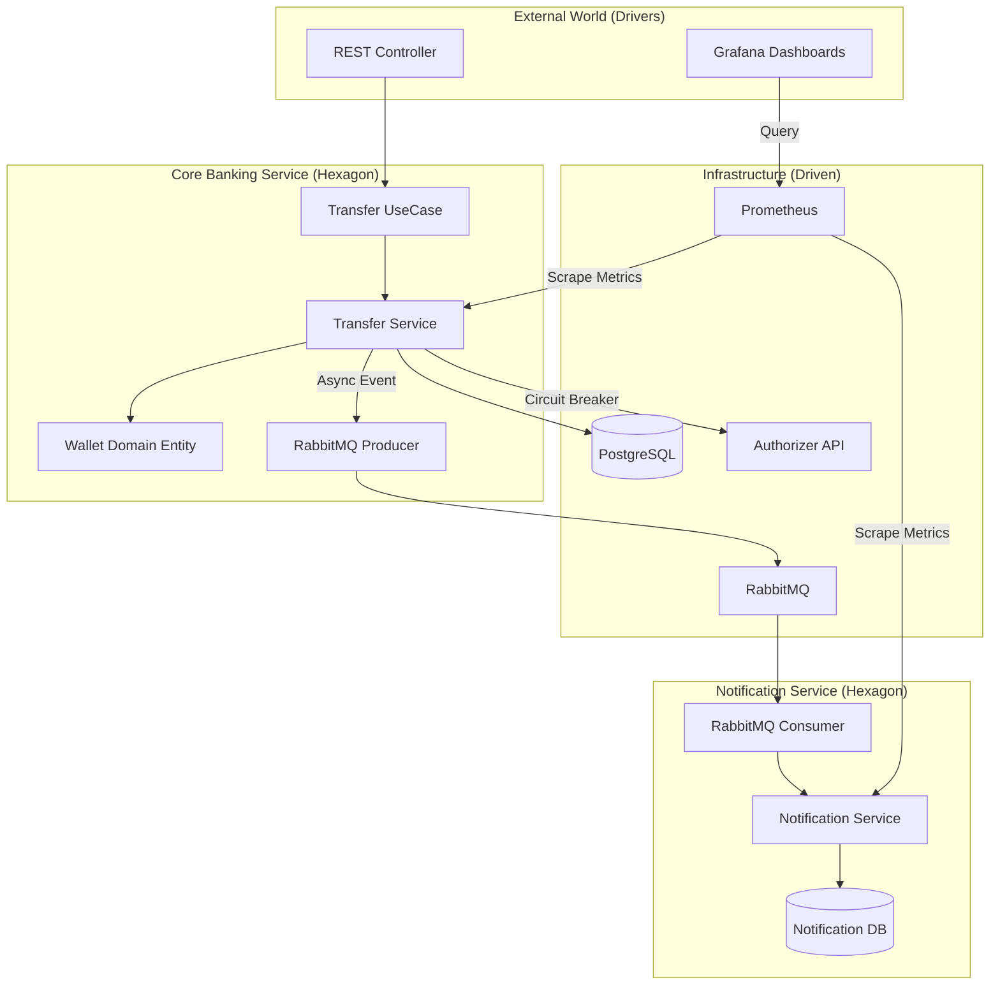

# 🛡️ Resilient Payment Gateway


> **Status:** ✅ Concluído (Fase 5)
> **Arquitetura:** Microsserviços Event-Driven
> **Foco:** Alta Concorrência, Resiliência, Observabilidade e Otimização de Recursos (AWS Free Tier).

---

## 🎯 Contexto do Projeto
Este é um sistema de Core Banking distribuído, desenvolvido para processar transações financeiras com alta disponibilidade e observabilidade, rodando sob restrições severas de recursos (AWS Free Tier - 1GB RAM).

O objetivo principal é manter o código limpo, garantir a cobertura de testes e manter a eficiência de recursos para que o deploy na nuvem permaneça estável.

---

## 🏗️ Arquitetura
O sistema segue uma arquitetura de **Microsserviços Event-Driven**:

1.  **Core Banking Service (Producer):** Responsável por gestão de carteiras (Wallets), usuários e execução da transação. Realiza chamadas síncronas para um "Autorizador Externo" (mock) e publica eventos de transação no RabbitMQ.
2.  **Notification Service (Consumer):** Consome eventos de transação concluída e simula o envio de notificações (e-mail/SMS) de forma assíncrona.



---

## 🛠️ Tech Stack

*   **Language:** Java 21
*   **Framework:** Spring Boot 3 (Web, Data JPA, Validation, Actuator)
*   **Database:** PostgreSQL 15 (Instância única com databases segregados: `db_core_banking` e `db_notification`).
*   **Messaging:** RabbitMQ (Exchange: `transaction-exchange`, Queue: `notification-queue`).
*   **Resilience:** Resilience4j (Circuit Breaker implementado na comunicação com o Autorizador Externo).
*   **Observability:** Prometheus (coleta de métricas JVM e Micrometer) e Grafana (Dashboards).
*   **Testing:** JUnit 5, Mockito e **Testcontainers** (Integração real com Postgres e RabbitMQ).

---

## ☁️ Infraestrutura & DevOps (Critical Constraints)

*   **Environment:** AWS EC2 t2.micro (1 vCPU, 1GB RAM).
*   **CI/CD:** Pipeline automatizado via **GitHub Actions**.
    *   **CI:** Build e Testes de Integração com Testcontainers a cada push.
    *   **CD:** Build de imagens Docker e Push automático para o Docker Hub na branch `main`.
*   **Containerization:** Docker & Docker Compose.
*   **Optimization:** Devido à baixa memória, todos os serviços Java rodam com a flag `JAVA_TOOL_OPTIONS="-Xms128m -Xmx300m"` para evitar OOM Kills. As imagens Docker utilizam base Alpine para serem mais leves.
*   **Security:** Credenciais de banco e broker são injetadas via variáveis de ambiente (`.env`).

---

## 🔄 Fluxo de Transação (Caminho Feliz)

1.  API recebe `POST /transfer`.
2.  Valida saldo da carteira de origem.
3.  Chama Autorizador Externo (protegido por Circuit Breaker).
4.  Persiste a transação no Postgres (Atomicidade).
5.  Publica evento `TransactionSuccessEvent` no RabbitMQ.
6.  Notification Service consome o evento e loga o envio.

---

## 💡 Decisões Técnicas Chave (Deep Dive)

### 1. Controle de Concorrência (Optimistic Locking)
Para evitar o problema de **Lost Update** (duas transações debitando a mesma carteira simultaneamente), utilizei a estratégia de **Optimistic Locking** com JPA (`@Version`).

### 2. Resiliência com Circuit Breaker (Fail Fast)
Antes de efetivar uma transferência, o sistema consulta um **Autorizador Externo**. Se a taxa de erros ultrapassar 50%, o circuito abre e o sistema falha imediatamente (Fail Fast), protegendo o Core.

### 3. Processamento Assíncrono e Idempotência
O **Notification Service** consome eventos do RabbitMQ. O consumidor verifica se a notificação já foi processada para o ID da transação (Chave de Idempotência), garantindo que mensagens duplicadas não gerem envios duplicados.

### 4. Observabilidade Centralizada
**Prometheus** coleta métricas expostas pelo Spring Boot Actuator e o **Grafana** exibe dashboards de performance (JVM, CPU, Latência HTTP) e métricas de negócio.

---

## 🧪 Estratégia de Testes

A qualidade é garantida através da Pirâmide de Testes, cobrindo **>83%** do código no Core Banking:

| Tipo | Ferramentas | O que testamos? |
| :--- | :--- | :--- |
| **Unitários** | JUnit 5, Mockito | Lógica de Domínio (`Wallet`), Casos de Uso e Services. |
| **Slice (Web)** | `@WebMvcTest` | Contrato da API, Serialização JSON e Tratamento de Exceções Global. |
| **Integração (DB)** | Testcontainers | Cenários de concorrência real no PostgreSQL (Double Spending). |
| **Integração (HTTP)** | WireMock | Simulação de falhas e timeouts do serviço externo para validar o Circuit Breaker. |
| **BDD** | AssertJ | Testes descritivos e legíveis focados em comportamento. |

---

## 🚀 Como Rodar Localmente

1.  **Configurar Variáveis de Ambiente:**
    ```bash
    cp .env.example .env
    ```

2.  **Subir a Infraestrutura:**
    ```bash
    docker-compose up -d
    ```

3.  **Executar os Serviços:**
    ```bash
    # Terminal 1
    cd core-banking-service && ./mvnw spring-boot:run
    
    # Terminal 2
    cd notification-service && ./mvnw spring-boot:run
    ```

4.  **Acessar Dashboards:**
    *   **Grafana:** http://localhost:3000 
    *   **Prometheus:** http://localhost:9090

---

## ☁️ Como Rodar em Produção (Docker)

Para ambientes de produção (como EC2), utilize o arquivo `docker-compose-prod.yml`.

1.  **Configurar Variáveis de Ambiente no Servidor:**
    Crie o arquivo `.env` no servidor com as senhas seguras de produção.

2.  **Subir a Stack Completa:**
    ```bash
    docker-compose -f docker-compose-prod.yml up -d
    ```

---

## ✅ Roadmap Concluído

- [x] Implementar Core Banking (Débito/Crédito).
- [x] Implementar Optimistic Locking (Concorrência).
- [x] Integração com Autorizador Externo (Feign + Resilience4j).
- [x] Publicação de Eventos no RabbitMQ (Producer).
- [x] Implementar Worker de Notificação (Consumer Assíncrono).
- [x] Implementar Idempotência (Chave única por transação).
- [x] Aumentar cobertura de testes para >80%.
- [x] Adicionar Observabilidade (Prometheus + Grafana).
- [x] Otimização para Cloud (Docker Alpine, JVM Tuning).
- [x] Deploy em Infraestrutura Cloud (AWS EC2).
- [x] Pipeline CI/CD (GitHub Actions + Testcontainers).

---

Developed by **Ryan Silva** 👨‍💻