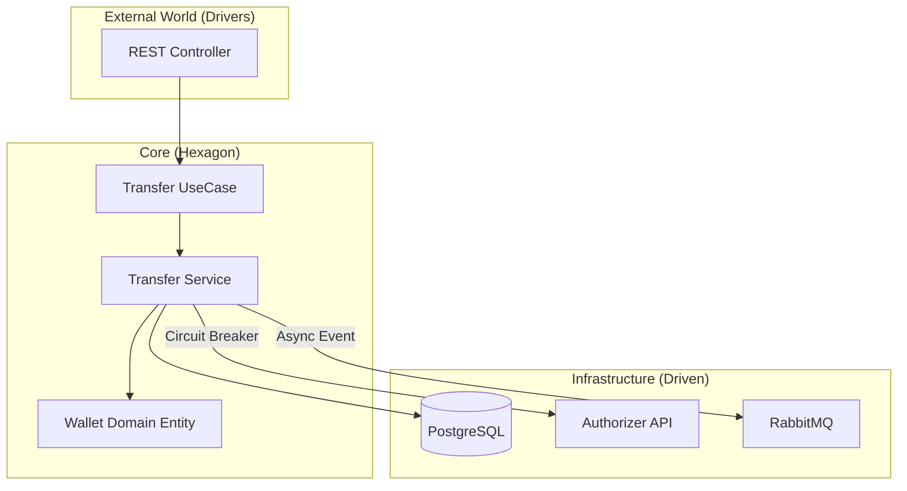

# 🛡️ Resilient Payment Gateway

> **Status:** 🚧 Em Desenvolvimento (Fase 2 Completa)
> **Arquitetura:** Hexagonal (Ports & Adapters)
> **Foco:** Alta Concorrência, Resiliência e Consistência de Dados.

---

## 🎯 Sobre o Projeto
Este projeto é uma prova de conceito (PoC) de um **Gateway de Pagamentos** robusto, projetado para processar transferências financeiras simulando desafios reais de grandes instituições bancárias.

O objetivo principal não é apenas realizar o CRUD de transferências, mas garantir:
1.  **Integridade Transacional:** Evitar gastos duplos (Double Spending) em cenários de alta concorrência.
2.  **Resiliência:** Proteger o Core Banking de falhas em serviços externos (Fail Fast).
3.  **Desacoplamento:** Arquitetura limpa para facilitar testes e manutenção.

---

## 🛠️ Tech Stack

* **Linguagem:** Java 21 (Records, Pattern Matching).
* **Framework:** Spring Boot 3.
* **Banco de Dados:** PostgreSQL 15.
* **Mensageria:** RabbitMQ (Producer implementado).
* **Resiliência:** Resilience4j (Circuit Breaker).
* **Comunicação:** Spring Cloud OpenFeign.
* **Testes:** JUnit 5, Mockito, Testcontainers (Postgres), WireMock.
* **Infraestrutura:** Docker & Docker Compose.

---

## 🏗️ Arquitetura e Design Patterns

O projeto segue estritamente a **Arquitetura Hexagonal (Ports & Adapters)**. O Domínio é o núcleo da aplicação e não possui dependências de frameworks ou bibliotecas externas.


```mermaid
graph TD
    subgraph "External World (Drivers)"
        API[REST Controller]
    end

    subgraph "Core (Hexagon)"
        InputPort[Transfer UseCase]
        Domain[Wallet Domain Entity]
        Service[Transfer Service]
    end

    subgraph "Infrastructure (Driven)"
        DB[(PostgreSQL)]
        Auth[Authorizer API]
        Queue[RabbitMQ]
    end

    API --> InputPort
    InputPort --> Service
    Service --> Domain
    Service --> DB
    Service -- Circuit Breaker --> Auth
    Service -- Async Event --> Queue
```
## 💡 Decisões Técnicas Chave (Deep Dive)

### 1. Controle de Concorrência (Optimistic Locking)
Para evitar o problema de **Lost Update** (duas transações debitando a mesma carteira simultaneamente), utilizei a estratégia de **Optimistic Locking** com JPA (`@Version`).

* **Como funciona:** Cada atualização verifica se a versão do registro no banco é a mesma que foi lida. Se houver divergência (outra thread alterou o dado), uma `ObjectOptimisticLockingFailureException` é lançada e tratada.
* **Validação:** Comprovado via Testes de Integração utilizando `CompletableFuture` e `CountDownLatch` para simular threads concorrentes.

### 2. Resiliência com Circuit Breaker (Fail Fast)
Antes de efetivar uma transferência, o sistema consulta um **Autorizador Externo**.

* **Problema:** Se o serviço externo cair, threads podem travar aguardando timeout, causando *Cascading Failure* no banco de dados.
* **Solução:** Implementação do **Resilience4j**. Se a taxa de erros ultrapassar 50%, o circuito abre e o sistema falha imediatamente (Fail Fast), protegendo o Core.

### 3. Tratamento de Erros (RFC 7807)
A API implementa o padrão **Problem Details for HTTP APIs (RFC 7807)** nativo do Spring Boot 3.

* **Erros de Negócio** -> `422 Unprocessable Entity` (com código interno de erro para o frontend).
* **Erros de Validação** -> `400 Bad Request` (com lista detalhada de campos inválidos).
* **Erros Inesperados** -> `500 Internal Server Error` (Log seguro no server, mensagem genérica para o cliente).

### 4. Padrão Command
Para isolar a camada Web do Domínio, o Controller não passa DTOs para o Service. Ele converte os DTOs em **Commands** (Java Records), garantindo que o Core não conheça anotações como `@JsonProperties` ou `@Valid`.

---

## 🧪 Estratégia de Testes

A qualidade é garantida através da Pirâmide de Testes, cobrindo >80% do código:

| Tipo | Ferramentas | O que testamos? |
| :--- | :--- | :--- |
| **Unitários** | JUnit 5, Mockito | Lógica de Domínio (`Wallet`) e orquestração do Service. |
| **Slice (Web)** | `@WebMvcTest` | Contrato da API, Serialização JSON e Tratamento de Exceções Global. |
| **Integração (DB)** | Testcontainers | Cenários de concorrência real no PostgreSQL (Double Spending). |
| **Integração (HTTP)** | WireMock | Simulação de falhas e timeouts do serviço externo para validar o Circuit Breaker. |

---

## 🚀 Como Rodar Localmente

### Pré-requisitos
* Java 21
* Docker & Docker Compose
* Maven

### Passo a Passo

1.  **Subir a Infraestrutura (Banco e RabbitMQ):**
    ```bash
    docker-compose up -d
    ```

2.  **Executar a Aplicação:**
    ```bash
    ./mvnw spring-boot:run
    ```

---

## 🚧 Próximos Passos (Roadmap)

- [x] Implementar Core Banking (Débito/Crédito).
- [x] Implementar Optimistic Locking (Concorrência).
- [x] Integração com Autorizador Externo (Feign + Resilience4j).
- [ ] Publicação de Eventos no RabbitMQ (Producer).
- [ ] Implementar Worker de Notificação (Consumer Assíncrono).
- [ ] Implementar Idempotência (Chave única por transação).
- [ ] Adicionar Observabilidade (Prometheus + Grafana).

---

Developed by **Ryan Silva** 👨‍💻
