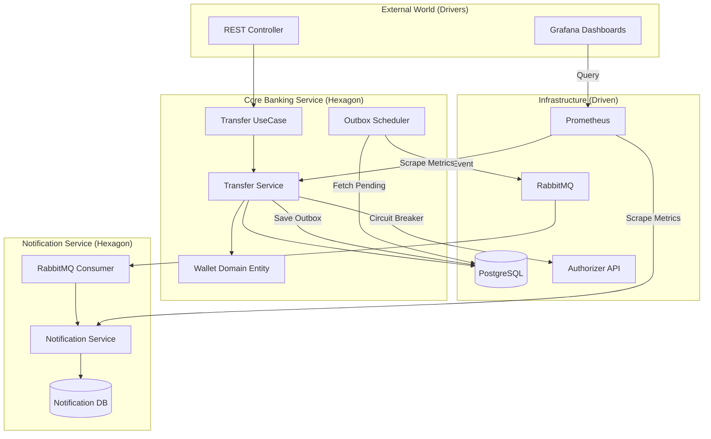

# 🛡️ Resilient Payment Gateway


> **Status:** ✅ Concluído (Fase 5)
> **Arquitetura:** Microsserviços Event-Driven
> **Foco:** Alta Concorrência, Resiliência, Observabilidade e Otimização de Recursos (AWS Free Tier).

---

## 🎯 Contexto do Projeto
Este é um sistema de Core Banking distribuído, desenvolvido para processar transações financeiras com alta disponibilidade e observabilidade, rodando sob restrições severas de recursos (AWS Free Tier - 1GB RAM).

O objetivo principal é manter o código limpo, garantir a cobertura de testes e manter a eficiência de recursos para que o deploy na nuvem permaneça estável.

---

## 🏗️ Arquitetura
O sistema segue uma arquitetura de **Microsserviços Event-Driven**:

1.  **Core Banking Service (Producer):** Responsável por gestão de carteiras (Wallets), usuários e execução da transação. Realiza chamadas síncronas para um "Autorizador Externo" (mock) e publica eventos de transação no RabbitMQ.
2.  **Notification Service (Consumer):** Consome eventos de transação concluída e simula o envio de notificações (e-mail/SMS) de forma assíncrona.


```mermaid
graph TD
    subgraph "External World (Drivers)"
        API[REST Controller]
        Grafana[Grafana Dashboards]
    end

    subgraph "Core Banking Service (Hexagon)"
        InputPort[Transfer UseCase]
        Domain[Wallet Domain Entity]
        Service[Transfer Service]
        OutboxScheduler[Outbox Scheduler]
    end

    subgraph "Notification Service (Hexagon)"
        Consumer[RabbitMQ Consumer]
        NotifService[Notification Service]
        NotifDB[(Notification DB)]
    end

    subgraph "Infrastructure (Driven)"
        DB[(PostgreSQL)]
        Auth[Authorizer API]
        Queue[RabbitMQ]
        Prometheus[Prometheus]
    end

    API --> InputPort
    InputPort --> Service
    Service --> Domain
    Service --> DB
    Service -- Circuit Breaker --> Auth
    Service -- Save Outbox --> DB
    OutboxScheduler -- Fetch Pending --> DB
    OutboxScheduler -- Publish Event --> Queue
    Queue --> Consumer
    Consumer --> NotifService
    NotifService --> NotifDB
    
    Prometheus -- Scrape Metrics --> Service
    Prometheus -- Scrape Metrics --> NotifService
    Grafana -- Query --> Prometheus
```

---

## 🛠️ Tech Stack

*   **Language:** Java 21
*   **Framework:** Spring Boot 3 (Web, Data JPA, Validation, Actuator)
*   **Database:** PostgreSQL 15 (Instância única com databases segregados: `db_core_banking` e `db_notification`).
*   **Messaging:** RabbitMQ (Exchange: `transaction-exchange`, Queue: `notification-queue`).
*   **Resilience:** Resilience4j (Circuit Breaker implementado na comunicação com o Autorizador Externo).
*   **Observability:** Prometheus (coleta de métricas JVM e Micrometer) e Grafana (Dashboards).
*   **Testing:** JUnit 5, Mockito e **Testcontainers** (Integração real com Postgres e RabbitMQ).

---

## ☁️ Infraestrutura & DevOps (Critical Constraints)

*   **Environment:** AWS EC2 t2.micro (1 vCPU, 1GB RAM).
*   **CI/CD:** Pipeline automatizado via **GitHub Actions**.
    *   **CI:** Build e Testes de Integração com Testcontainers a cada push.
    *   **CD:** Build de imagens Docker e Push automático para o Docker Hub na branch `main`.
*   **Containerization:** Docker & Docker Compose.
*   **IaC:** Terraform com LocalStack para simulação de ambiente AWS e Backend Remoto (S3).
*   **Optimization:** Devido à baixa memória, todos os serviços Java rodam com a flag `JAVA_TOOL_OPTIONS="-Xms128m -Xmx300m"` para evitar OOM Kills. As imagens Docker utilizam base Alpine para serem mais leves.
*   **Security:** Credenciais de banco e broker são injetadas via variáveis de ambiente (`.env`).

---

## 🔄 Fluxo de Transação (Caminho Feliz)

1.  API recebe `POST /transfer`.
2.  Valida saldo da carteira de origem.
3.  Chama Autorizador Externo (protegido por Circuit Breaker).
4.  Persiste a transação no Postgres (Atomicidade).
5.  **Transactional Event Listener:** Após o commit bem-sucedido no banco, publica o evento `TransactionSuccessEvent` no RabbitMQ.
6.  Notification Service consome o evento, processa e envia o **ACK manual** para o RabbitMQ.

---

## 💡 Decisões Técnicas Chave (Deep Dive)

### 1. Controle de Concorrência (Optimistic Locking)
Para evitar o problema de **Lost Update** (duas transações debitando a mesma carteira simultaneamente), o sistema usa a estratégia de **Optimistic Locking** com JPA (`@Version`).

### 2. Resiliência com Circuit Breaker (Fail Fast)
Antes de efetivar uma transferência, o sistema consulta um **Autorizador Externo**. Se a taxa de erros ultrapassar 50%, o circuito abre e o sistema falha imediatamente (Fail Fast), protegendo o Core.

### 3. Consistência Eventual com Transactional Outbox
Para garantir a entrega *At-Least-Once* de eventos sem perdas, salvamos os dados do evento na tabela `outbox_event` sob a mesma transação da transferência. Um worker agendado (`OutboxScheduler`) lê os eventos pendentes e os publica de forma assíncrona no RabbitMQ, removendo-os da tabela após a confirmação.

### 4. Confiabilidade no Consumo (Manual ACK e DLQ)
O **Notification Service** utiliza `AcknowledgeMode.MANUAL`. Se o processamento de uma notificação falhar por problemas persistentes (como e-mail inválido ou falhas de dados), a aplicação envia um `basicNack` com `requeue=false`, e o RabbitMQ direciona a mensagem para uma **Dead Letter Queue (DLQ)**, evitando o travamento da fila principal com mensagens inválidas (Poison Pills).

### 5. Idempotência
O consumidor verifica se a notificação já foi processada para o ID da transação (Chave de Idempotência), garantindo que mensagens duplicadas (comuns em sistemas distribuídos) não gerem envios duplicados.

### 6. Network I/O Fora de Transações
A chamada externa de rede ao Autorizador foi movida para fora do bloco transacional. O sistema utiliza `TransactionTemplate` para abrir transações curtas no banco apenas no momento de atualizar os saldos e salvar o outbox, evitando o travamento do pool de conexões (HikariCP).

### 7. Observabilidade Centralizada
**Prometheus** coleta métricas expostas pelo Spring Boot Actuator e o **Grafana** exibe dashboards de performance (JVM, CPU, Latência HTTP) e métricas de negócio.

---

## 🧪 Estratégia de Testes

A qualidade é garantida através da Pirâmide de Testes, cobrindo **>83%** do código no Core Banking:

| Tipo | Ferramentas | O que testamos? |
| :--- | :--- | :--- |
| **Unitários** | JUnit 5, Mockito | Lógica de Domínio (`Wallet`), Casos de Uso e Services. |
| **Slice (Web)** | `@WebMvcTest` | Contrato da API, Serialização JSON e Tratamento de Exceções Global. |
| **Integração (DB)** | Testcontainers | Cenários de concorrência real no PostgreSQL (Double Spending). |
| **Integração (Messaging)** | Testcontainers | Publicação e consumo de mensagens no RabbitMQ com validação de ACK/NACK. |
| **Integração (HTTP)** | WireMock | Simulação de falhas e timeouts do serviço externo para validar o Circuit Breaker. |
| **BDD** | AssertJ | Testes descritivos e legíveis focados em comportamento. |

---

## 🚀 Como Rodar Localmente

1.  **Configurar Variáveis de Ambiente:**
    ```bash
    cp .env.example .env
    ```

2.  **Subir a Infraestrutura:**
    ```bash
    docker-compose up -d
    ```

3.  **Executar os Serviços:**
    ```bash
    # Terminal 1
    cd core-banking-service && ./mvnw spring-boot:run
    
    # Terminal 2
    cd notification-service && ./mvnw spring-boot:run
    ```

4.  **Acessar Dashboards:**
    *   **Grafana:** http://localhost:3000 
    *   **Prometheus:** http://localhost:9090

---

## ☁️ Como Rodar em Produção (Docker)

Para ambientes de produção (como EC2), utilize o arquivo `docker-compose-prod.yml`.

1.  **Configurar Variáveis de Ambiente no Servidor:**
    Crie o arquivo `.env` no servidor com as senhas seguras de produção.

2.  **Subir a Stack Completa:**
    ```bash
    docker-compose -f docker-compose-prod.yml up -d
    ```

---

## 🏗️ Infraestrutura como Código (Terraform + LocalStack)

Este projeto utiliza **Terraform** para gerenciar a infraestrutura como código (IaC), permitindo a criação de um ambiente AWS simulado localmente com **LocalStack**. Isso garante que o desenvolvimento da infraestrutura seja rápido, gratuito e consistente.

### Pré-requisitos
1.  **Docker e Docker Compose:** Essenciais para rodar o ambiente local.
2.  **Terraform:** [Instale o Terraform](https://learn.hashicorp.com/tutorials/terraform/install-cli) para sua plataforma.

### Como Usar

1.  **Subir o Ambiente Local:**
    Na raiz do projeto, use o arquivo `docker-compose.yml` para iniciar todos os serviços, incluindo banco de dados, mensageria e o LocalStack.
    ```bash
    docker-compose up -d
    ```

2.  **Criar o Backend Remoto:**
    Antes de inicializar o Terraform, é necessário criar o bucket S3 e a tabela DynamoDB no LocalStack para armazenar o estado de forma segura. Execute o script no container do aws-cli:
    ```bash
    docker-compose exec aws-cli sh /scripts/create-backend.sh
    ```

3.  **Inicializar o Terraform:**
    Navegue até a pasta `infra` e execute `init` para que o Terraform baixe os plugins necessários e configure o backend S3.
    ```bash
    cd infra
    terraform init
    ```

4.  **Planejar e Aplicar a Infraestrutura:**
    Use `plan` para ver o que será criado e `apply` para executar a criação dos recursos (VPC, EC2, etc.) no LocalStack.
    ```bash
    # Veja o que será criado (opcional, mas recomendado)
    terraform plan

    # Aplique a configuração e digite "yes" para confirmar
    terraform apply
    ```
    Ao final, o Terraform terá "criado" a infraestrutura AWS no seu ambiente Docker e o script `setup.sh` terá sido configurado para rodar na EC2 simulada.

5.  **Destruir a Infraestrutura (Opcional):**
    Para remover todos os recursos criados pelo Terraform no LocalStack:
    ```bash
    terraform destroy
    ```

---

## 📊 Resultados de Testes de Carga (k6)

O script `teste-carga.js` executa um cenário de 200 usuários virtuais concorrentes (VUs) durante 30 segundos, distribuindo as transações em um pool de 50 pagadores e 50 recebedores com saldos de R$ 10.000.000,00 cada. Isso simula o comportamento de produção distribuído e evita gargalos artificiais no banco de dados.

### Resultados sob Limites de Memória (JVM limitadas a 300MB)

*   **Vazão Bruta (Throughput):** `1.561 req/s`
*   **Taxa de Sucesso (Transações Aprovadas):** **`78.29%`** (`36.817` transações concluídas)
*   **Vazão Útil de Negócio:** **`1.227` transações concluídas por segundo**
*   **Latência Média:** `127.63ms`
*   **P95:** `187.66ms`

```text
TOTAL RESULTS 

    checks_total.......: 47024  1561.44605/s
    checks_succeeded...: 78.29% 36817 out of 47024
    checks_failed......: 21.70% 10207 out of 47024

    ✗ transacao aprovada
      ↳  78% — ✓ 36817 / ✗ 10207

    HTTP
    http_req_duration..............: avg=127.63ms min=1.79ms med=115.54ms max=1.17s p(90)=165.63ms p(95)=187.66ms
      { expected_response:true }...: avg=128.18ms min=3.52ms med=115.71ms max=1.17s p(90)=166.19ms p(95)=188.32ms
    http_req_failed................: 21.70% 10207 out of 47024
    http_reqs......................: 47024  1561.44605/s
```

*Nota: Os 21.70% de requisições rejeitadas são decorrentes de conflitos de concorrência (`Optimistic Locking`) na atualização de saldo das mesmas carteiras no Postgres (HTTP 409). Esse comportamento é esperado e garante a consistência do saldo sob carga intensa concorrente de 200 VUs em 50 contas.*

---

## ✅ Roadmap Concluído

- [x] Implementar Core Banking (Débito/Crédito).
- [x] Implementar Optimistic Locking (Concorrência).
- [x] Integração com Autorizador Externo (Feign + Resilience4j).
- [x] Publicação de Eventos no RabbitMQ (Producer).
- [x] Implementar Worker de Notificação (Consumer Assíncrono).
- [x] Implementar Idempotência (Chave única por transação).
- [x] Implementar Transactional Event Listener (Consistência).
- [x] Implementar Manual ACK no Consumer (Confiabilidade).
- [x] Aumentar cobertura de testes para >80%.
- [x] Adicionar Observabilidade (Prometheus + Grafana).
- [x] Otimização para Cloud (Docker Alpine, JVM Tuning).
- [x] Deploy em Infraestrutura Cloud (AWS EC2).
- [x] Pipeline CI/CD (GitHub Actions + Testcontainers).
- [x] **Infraestrutura como Código com Terraform e LocalStack.**
- [x] **Configuração de Backend Remoto (S3) para o Terraform.**

---

Developed by **Ryan Silva** 👨‍💻